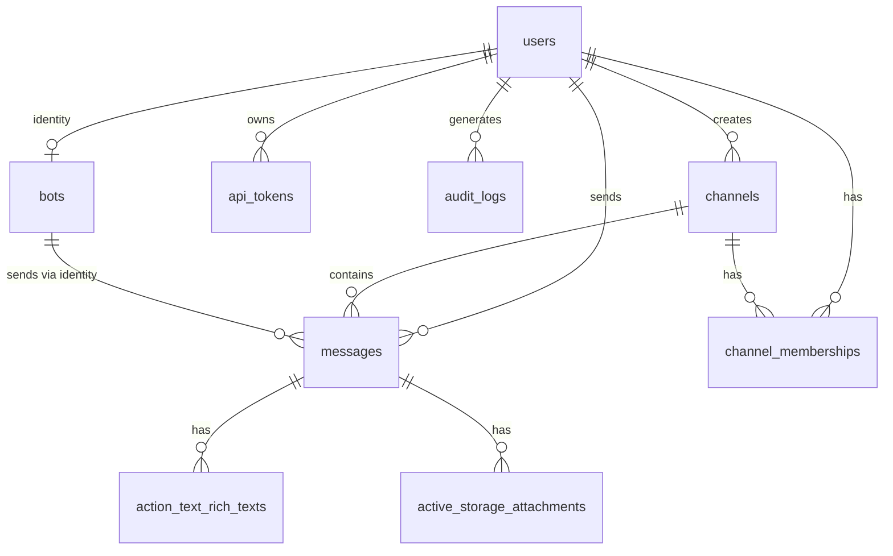

# Database Schema

HomeChat uses SQLite for simplicity and portability. This document describes the database structure.

## Entity Relationship Diagram



## Tables

### users

Core user accounts for authentication and identification.

| Column | Type | Description |
|--------|------|-------------|
| `id` | integer | Primary key |
| `username` | string | Unique username (required) |
| `password_digest` | string | bcrypt hash |
| `role` | string | `user` or `admin` (default: user) |
| `status` | string | Status message (default: "Available") |
| `is_online` | boolean | Online presence |
| `last_seen_at` | datetime | Last activity timestamp |
| `fcm_token` | string | Firebase push notification token |
| `timezone` | string | User timezone (default: UTC) |
| `failed_attempts` | integer | Failed login count |
| `locked_until` | datetime | Account lockout expiry |
| `last_failed_at` | datetime | Last failed login |
| `otp_secret` | string | TOTP secret for 2FA |
| `otp_required_for_login` | boolean | 2FA enabled flag |
| `otp_backup_codes` | text | Encrypted backup codes |
| `created_at` | datetime | Account creation |
| `updated_at` | datetime | Last update |

**Indexes:**
- `username` (unique)
- `is_online`
- `last_seen_at`
- `locked_until`
- `fcm_token`

### channels

Chat rooms for group conversations.

| Column | Type | Description |
|--------|------|-------------|
| `id` | integer | Primary key |
| `name` | string | Unique channel name (required) |
| `description` | text | Channel description |
| `channel_type` | string | `public` or `private` |
| `created_by_id` | integer | FK to users |
| `memberships_count` | integer | Counter cache |
| `last_message_at` | datetime | For sorting |
| `created_at` | datetime | Creation time |
| `updated_at` | datetime | Last update |

**Indexes:**
- `name` (unique)
- `channel_type`
- `created_by_id`
- `last_message_at`

### messages

Individual chat messages.

| Column | Type | Description |
|--------|------|-------------|
| `id` | integer | Primary key |
| `content` | text | Message text (required) |
| `user_id` | integer | FK to users (sender) |
| `channel_id` | integer | FK to channels |
| `message_type` | string | Message classification |
| `created_at` | datetime | Send time |
| `updated_at` | datetime | Edit time |

**Indexes:**
- `channel_id`
- `user_id`
- `message_type`
- `(channel_id, created_at)` — For pagination
- `(user_id, created_at)` — For user history

**Associations:**
- Has rich text body (Action Text)
- Has many attachments (Active Storage)

### channel_memberships

Join table for users in channels.

| Column | Type | Description |
|--------|------|-------------|
| `id` | integer | Primary key |
| `user_id` | integer | FK to users |
| `channel_id` | integer | FK to channels |
| `joined_at` | datetime | Join timestamp |
| `created_at` | datetime | Record creation |
| `updated_at` | datetime | Last update |

**Indexes:**
- `(user_id, channel_id)` (unique)
- `user_id`
- `channel_id`

### bots

AI-powered chat bots.

| Column | Type | Description |
|--------|------|-------------|
| `id` | integer | Primary key |
| `name` | string | Bot name |
| `description` | text | Bot description |
| `active` | boolean | Enabled/disabled |
| `bot_type` | string | Bot classification |
| `webhook_id` | string | External webhook ID |
| `webhook_secret` | string | Webhook auth secret |
| `identity_user_id` | integer | FK to users (bot's user account) |
| `instructions` | text | LLM system prompt |
| `model` | string | LLM model to use |
| `created_at` | datetime | Creation time |
| `updated_at` | datetime | Last update |

**Indexes:**
- `identity_user_id`

### api_tokens

API authentication tokens.

| Column | Type | Description |
|--------|------|-------------|
| `id` | integer | Primary key |
| `name` | string | Token name/description (unique) |
| `token_digest` | string | bcrypt hash of full token (unique) |
| `token_prefix` | string | First 8 chars for identification |
| `user_id` | integer | FK to users (owner) |
| `active` | boolean | Token enabled |
| `last_used_at` | datetime | Last API call |
| `created_at` | datetime | Creation time |
| `updated_at` | datetime | Last update |

**Indexes:**
- `name` (unique)
- `token_digest` (unique)
- `token_prefix`
- `(active, token_prefix)` — For lookup
- `user_id`

### audit_logs

Security audit trail.

| Column | Type | Description |
|--------|------|-------------|
| `id` | integer | Primary key |
| `user_id` | integer | FK to users (nullable for system) |
| `action` | string | Action performed (required) |
| `resource_type` | string | Affected model (required) |
| `resource_id` | bigint | Affected record ID |
| `ip_address` | string | Client IP |
| `user_agent` | string | Client user agent |
| `changes_made` | json | Changed attributes |
| `metadata` | json | Additional context |
| `created_at` | datetime | Action timestamp |
| `updated_at` | datetime | Update time |

**Indexes:**
- `user_id`
- `action`
- `(resource_type, resource_id)`
- `created_at`

### settings

Application configuration key-value store.

| Column | Type | Description |
|--------|------|-------------|
| `id` | integer | Primary key |
| `key` | string | Setting name (unique, required) |
| `value` | text | Setting value |
| `created_at` | datetime | Creation time |
| `updated_at` | datetime | Last update |

**Indexes:**
- `key` (unique)

### Active Storage Tables

#### active_storage_blobs

File metadata storage.

| Column | Type | Description |
|--------|------|-------------|
| `id` | integer | Primary key |
| `key` | string | Storage key (unique) |
| `filename` | string | Original filename |
| `content_type` | string | MIME type |
| `metadata` | text | File metadata |
| `service_name` | string | Storage service |
| `byte_size` | bigint | File size |
| `checksum` | string | Content hash |
| `created_at` | datetime | Upload time |

#### active_storage_attachments

Links files to records.

| Column | Type | Description |
|--------|------|-------------|
| `id` | integer | Primary key |
| `name` | string | Attachment name |
| `record_type` | string | Polymorphic type |
| `record_id` | integer | Polymorphic ID |
| `blob_id` | integer | FK to blobs |
| `created_at` | datetime | Creation time |

#### active_storage_variant_records

Processed image variants.

| Column | Type | Description |
|--------|------|-------------|
| `id` | integer | Primary key |
| `blob_id` | integer | FK to blobs |
| `variation_digest` | string | Variant hash |

### Action Text Tables

#### action_text_rich_texts

Rich text content for messages.

| Column | Type | Description |
|--------|------|-------------|
| `id` | integer | Primary key |
| `name` | string | Attribute name |
| `body` | text | HTML content |
| `record_type` | string | Polymorphic type |
| `record_id` | integer | Polymorphic ID |
| `created_at` | datetime | Creation time |
| `updated_at` | datetime | Last update |

## Foreign Key Relationships

```sql
-- API tokens belong to users
api_tokens.user_id → users.id

-- Audit logs reference users
audit_logs.user_id → users.id

-- Bots have identity users
bots.identity_user_id → users.id

-- Channel memberships
channel_memberships.user_id → users.id
channel_memberships.channel_id → channels.id

-- Channels are created by users
channels.created_by_id → users.id

-- Messages belong to users and channels
messages.user_id → users.id
messages.channel_id → channels.id

-- Active Storage
active_storage_attachments.blob_id → active_storage_blobs.id
active_storage_variant_records.blob_id → active_storage_blobs.id
```

## Data Integrity

### Constraints

- Usernames are unique and required
- Channel names are unique and required
- Message content is required
- Channel membership is unique per user/channel pair
- API token names and digests are unique

### Cascading Behavior

Foreign keys use default SQLite behavior. When deleting:
- Users: Consider implications for messages, channels, memberships
- Channels: Messages and memberships should be cleaned up
- Blobs: Attachments and variants reference blobs

## Migration History

The schema is managed through Rails migrations. Current version: `2026_01_09_022508`

Run migrations:
```bash
bin/rails db:migrate
```

View migration status:
```bash
bin/rails db:migrate:status
```

## Backup

The entire database is a single file:
```bash
cp db/production.sqlite3 backup/
```

For production (Docker/add-on):
```bash
cp /data/production.sqlite3 backup/
```
