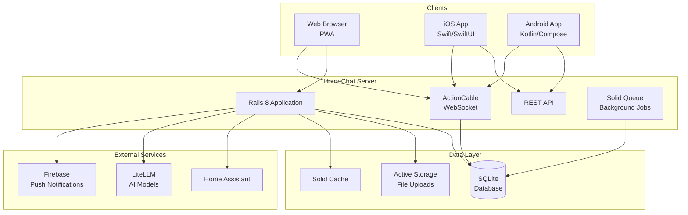
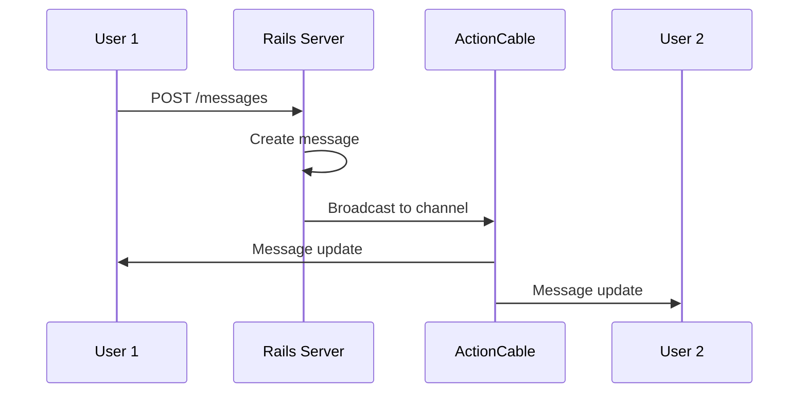
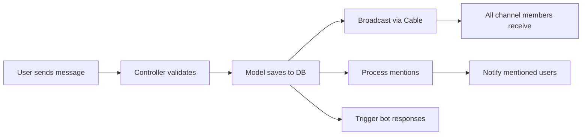
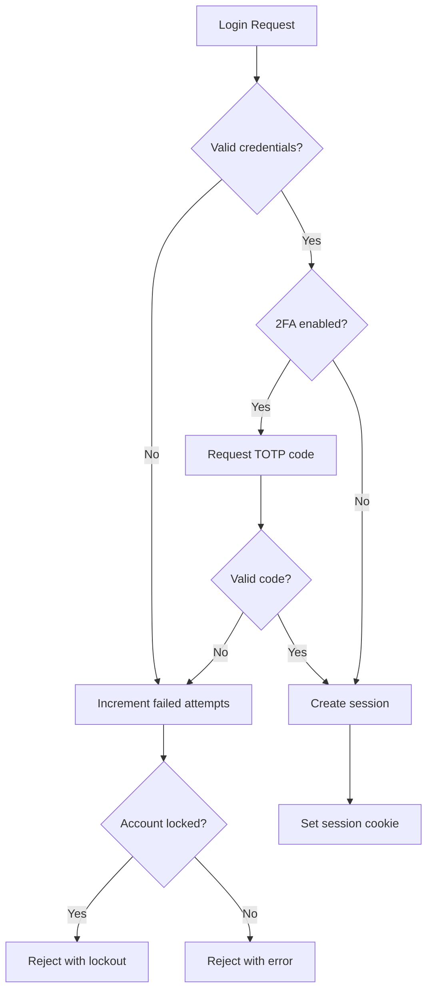
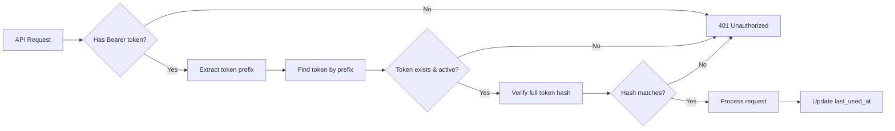
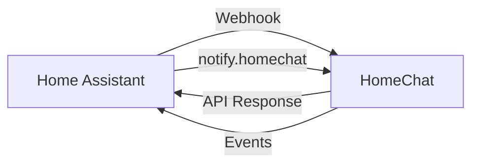
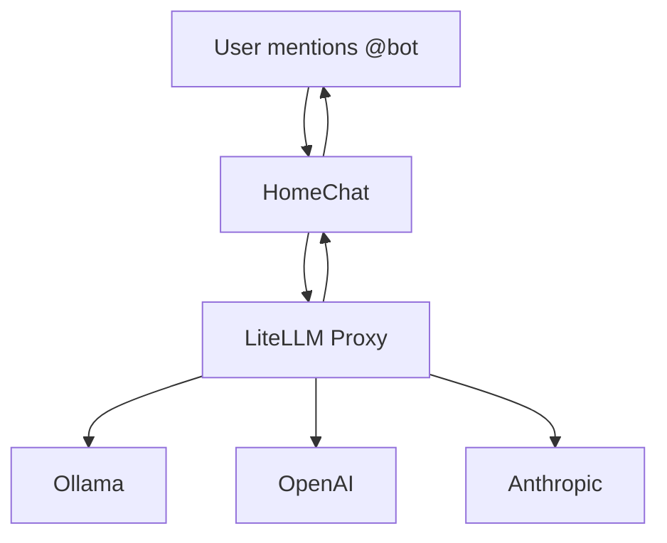
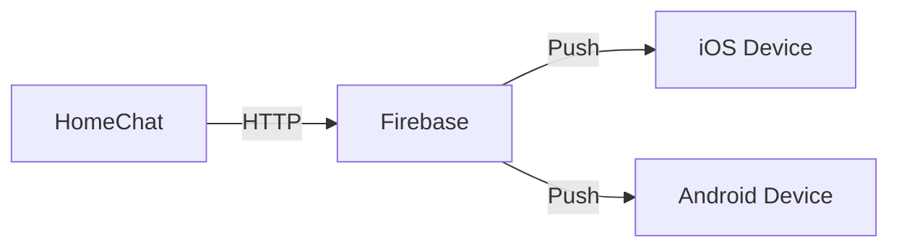
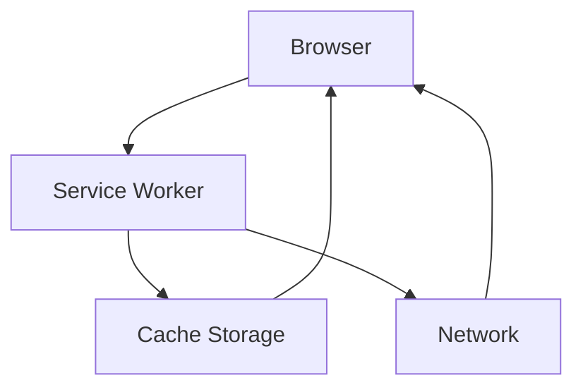

# Architecture Overview

HomeChat is a self-hosted, offline-first chat application built on Rails 8 with real-time messaging capabilities.

## System Diagram

## Core Components

### Web Application (Rails 8)

The main application server handles all HTTP requests and WebSocket connections.

| Component | Purpose |
|-----------|---------|
| Controllers | Handle HTTP requests and responses |
| Models | Business logic and data validation |
| Views | HTML templates with Hotwire |
| Channels | ActionCable WebSocket handlers |
| Jobs | Background processing (Solid Queue) |

### Real-Time Messaging

HomeChat uses ActionCable with Solid Cable for real-time updates without Redis:

**Key channels:**
- `ChannelChannel` — Channel messages and updates
- `PresenceChannel` — User online/offline status
- `NotificationsChannel` — Personal notifications

### Database Layer

SQLite with Active Record provides:
- Simple deployment (single file database)
- No external dependencies
- Easy backup and portability

See [Database Schema](database-schema.md) for table details.

### File Storage

Active Storage manages file uploads:
- Images with automatic resizing (vips)
- Attachments stored in `/data/storage/`
- Variant generation for thumbnails

### Background Jobs

Solid Queue handles async processing:
- Push notification delivery
- Webhook processing
- Bot message handling

## Data Flow

### Message Flow

### Authentication Flow

### API Authentication

## Technology Stack

### Backend

| Technology | Purpose |
|------------|---------|
| Ruby 3.3 | Programming language |
| Rails 8.0 | Web framework |
| SQLite 3 | Database |
| Puma | Application server |
| Solid Cable | ActionCable adapter |
| Solid Queue | Job processing |
| Solid Cache | Caching |

### Frontend

| Technology | Purpose |
|------------|---------|
| Hotwire | SPA-like interactivity |
| Turbo | Navigation and forms |
| Stimulus | JavaScript controllers |
| Tailwind CSS | Styling |
| Propshaft | Asset pipeline |
| Importmap | JavaScript modules |

### Deployment

| Technology | Purpose |
|------------|---------|
| Docker | Containerization |
| Kamal | Zero-downtime deployment |
| Thruster | Asset serving and HTTP/2 |

## Integration Points

### Home Assistant

Two integration methods:

1. **Add-on**: Runs HomeChat as an HA supervised container
2. **Integration**: Custom component for HA automations

Communication flow:

### AI Bots

LiteLLM provides a unified interface to multiple LLM providers:

### Push Notifications

Firebase Cloud Messaging for mobile push:

## Offline-First Design

HomeChat works without internet connectivity:

| Feature | Implementation |
|---------|----------------|
| No CDN dependencies | All assets served locally |
| No external fonts | System fonts or bundled |
| Database-backed ActionCable | Solid Cable, no Redis |
| PWA caching | Service worker for app shell |
| Mobile offline | Core Data (iOS), Room (Android) |

### PWA Architecture

## Security Architecture

See [Security Hardening Guide](../security/hardening-guide.md) for detailed security information.

### Key Security Features

- bcrypt password hashing
- TOTP two-factor authentication
- Hashed API tokens with prefix identification
- Rate limiting (Rack::Attack)
- Audit logging
- Account lockout

## Scalability Considerations

HomeChat is designed for household/small team use:

| Metric | Typical Capacity |
|--------|------------------|
| Users | 10-50 |
| Messages/day | 1,000-10,000 |
| Concurrent connections | 10-50 |
| Database size | < 1GB |

For larger deployments, consider:
- PostgreSQL instead of SQLite
- Redis for ActionCable and caching
- Multiple server instances behind load balancer
